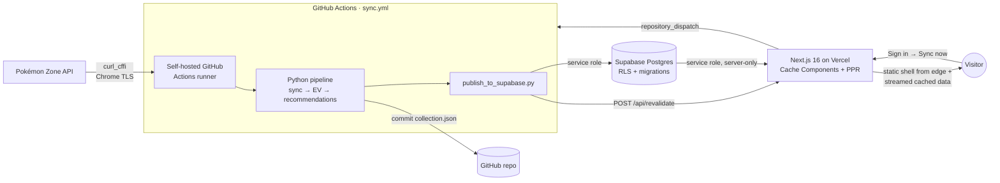

# Pokémon TCG Pocket — Collection Optimizer

A full-stack collection tracker and **pack-opening optimizer** for Pokémon TCG
Pocket. It syncs a live collection from [Pokémon Zone](https://pokemon-zone.com/),
runs an expected-value model over every purchasable pack, and serves the results
as a fast, cached dashboard — telling you exactly which pack to open next for the
most new cards per in-game currency.

**Live:** https://pokemon-tcgp-db-ten.vercel.app

> A personal tool built as a study in modern full-stack engineering: a Python
> analytics pipeline, a Postgres data layer with row-level security, and a
> Next.js 16 front end using Cache Components / Partial Prerendering — wired
> together by a CI-driven sync that runs on a self-hosted runner.

<!-- Screenshots: drop dashboard / cards / history images in docs/ and reference them here. -->

---

## What it does

- **Syncs** your collection from Pokémon Zone (exact card identity, no fuzzy matching).
- **Scores** all ~26 purchasable packs with an EV model that weights new cards,
  duplicates, and rarity, adjusted by a per-pack confidence factor.
- **Recommends** what to open next given your hourglass balance.
- **Tracks drift** — an append-only history of how your collection and pack
  rankings change over time, charted on `/history`.
- **Public read, owner-gated writes** — anyone can browse the collection and
  recommendations; only the authenticated owner can trigger a sync.

---

## Architecture

The Python pipeline stays the **source of truth** for all analytics; hosting is
purely additive behind two seams (`DataSource` for reads, `SyncRunner` for
writes), so the same code runs locally against JSON files or in production
against Postgres.



### Data flow: sync → publish → serve

1. **Trigger** — the owner clicks *Sync now* on the dashboard. A stateless
   `SyncRunner` fires a GitHub `repository_dispatch` (it does **not** run Python
   on Vercel — Python can't run there).
2. **Sync** — the workflow runs on a **self-hosted runner** (GitHub's cloud IPs
   are blocked by Cloudflare; a home-network runner is not). It fetches the
   collection using `curl_cffi` Chrome impersonation with stored auth.
3. **Compute** — the untouched pipeline builds pack EV + recommendations.
4. **Publish** — `publish_to_supabase.py` upserts the artifacts into Postgres
   with the service-role key and appends a recommendation snapshot.
5. **Invalidate** — the workflow POSTs to a secret-guarded `/api/revalidate`,
   which calls `revalidateTag()` so the next request re-reads fresh data.
6. **Serve** — the web app returns a prerendered static shell from the CDN edge
   and streams the cached, per-request data into it.

The web app never blocks the deploy on pipeline artifacts (they're gitignored),
so CI and fresh checkouts build cleanly in a data-free `local-json` mode.

---

## Tech stack

| Layer | Choices |
|---|---|
| **Front end** | Next.js 16 (App Router, **Cache Components / PPR**), React 19, TypeScript, Tailwind CSS v4, Base UI + shadcn-style components, Recharts |
| **Data / auth** | Supabase Postgres, Row-Level Security, `@supabase/ssr` (session cookies via Next 16 `proxy.ts`), Zod-validated contracts |
| **Pipeline** | Python 3, `curl_cffi` (Chrome TLS impersonation), a pure-function EV model |
| **Infra / CI** | Vercel (Fluid Compute), GitHub Actions (self-hosted + cloud runners), tag-based cache invalidation |
| **Testing** | Vitest (web) + a `DataSource` parity contract, pytest with a golden-snapshot regression gate |

---

## Engineering highlights

The parts that were interesting to build:

- **Cache Components + PPR, not `force-dynamic`.** Every page renders a
  prerendered static shell (served from the edge) plus `<Suspense>` dynamic
  holes streaming cached data. Data readers are wrapped in `use cache` +
  `cacheTag`, so ~3,500-row Supabase reads become cache hits invalidated only on
  publish — turning a ~2.4 s cold TTFB into an edge cache hit (`x-vercel-cache: HIT`).
- **Keeping the CI build green under Cache Components.** Because the CI build
  runs data-free, cached reads are forced runtime-only (via `connection()` or
  the request's own `searchParams`/`params`) so they never execute during
  prerender against missing artifacts.
- **Public read / owner-gated writes.** Reads use the service-role key
  server-side (never shipped to the client); the sync **write** path is gated to
  the authenticated owner's UUID — closing a would-be public trigger for the
  whole pipeline.
- **Cloudflare-aware sync.** The sync is pure HTTP with stored auth, but
  Cloudflare blocks datacenter IPs — so the live sync runs on a self-hosted
  runner, with graceful `needs-reauth` handling surfaced in the UI when the
  ~3–4-week PZ session lapses.
- **One data model, two backends.** A `DataSource` interface
  (`web/lib/data/`) has a `local-json` and a `supabase` implementation, both
  validated through the **same Zod schemas** and checked by a parity contract
  test — so hosting never forked the read logic.

---

## Data model

Postgres schema in `supabase/migrations/` (applied in order):

| Migration | Adds |
|---|---|
| `0001_init` | Global catalog tables + per-user tables (collection, EV, recommendations, sync status) with RLS |
| `0002_auth_owner` | Seeds the auth owner, backfills `user_id`, adds the FK, drops temporary anon policies |
| `0003_sync_last_run` | `sync_status.last_run` completion marker for honest sync-completion reporting |
| `0004_recommendation_snapshots` | Append-only history table powering `/history` |

Global data (cards, packs, odds) has no `user_id`; per-user data carries
`user_id` with `user_id = auth.uid()` policies — modeled multi-user, run
single-tenant.

---

## EV model

```
EV per pack = Σ (p_pull × value_of_next_copy)

value_of_next_copy (per printing, each set coordinate counted independently):
  owned = 0  →  1.0 + RARITY_BONUS[rarity]   (ultra_rare 10.0 … uncommon 0.0)
  owned = 1  →  0.4
  owned ≥ 2  →  0.0

unified_score = new_card_ev_10x×1.0 + copy_ev×0.2 + deck_target_ev×1.5
               (× confidence_weight; 1.0 for pz_verified packs)
```

Pull odds come from Pokémon Zone pack pages, cross-checked against Bulbapedia;
packs that aren't fully verified take a confidence haircut.

---

## Local development

### Web app

```bash
cd web
npm install
npm run dev          # DATA_SOURCE defaults to local-json (reads pipeline artifacts)
npm run build        # production build (Cache Components)
npm test             # Vitest + DataSource parity contract
```

To run against Supabase locally, set `DATA_SOURCE=supabase` plus the Supabase
env vars (see `web/lib/env.ts` — all server-only, none `NEXT_PUBLIC_`).

### Python pipeline

```bash
python3 scripts/run_recommendations.py            # full run: sync + EV + recommendations
python3 scripts/run_recommendations.py --skip-sync # recompute from current collection.json
python3 -m pytest tests/ -q                        # full suite incl. golden snapshot
```

**Common flags:** `--skip-sync`, `--json-import [FILE]`, `--dry-run-sync`,
`--promo`, `--full-rankings`, `--include-limited`, `--series {A,B}`.
**Exit codes:** `0` OK · `1` fatal · `2` review-queue items · `3` PZ auth expired
(collection not refreshed; consumed by the web sync runner as *needs re-auth*).

Sync options (bookmarklet / stored-auth headless / HAR import) and reference-data
rebuild scripts are documented inline in `scripts/` and
[`docs/`](docs/). `collection.json` is the tracked source of truth; `data/current/`,
`data/exports/`, and `review/` are gitignored build artifacts.

---

## Testing & CI

`.github/workflows/ci.yml` runs on every PR:

- **`test`** — `pytest tests/` including a **golden-snapshot** test that fails if
  EV/recommendation output drifts (the pipeline is never edited for hosting).
- **`web`** — `lint`, `typecheck`, Vitest, and `next build` in data-free mode
  (the same constraint production caching had to satisfy).

`sync.yml` handles live syncs (self-hosted, `repository_dispatch`) and
`--skip-sync` republishes (cloud runner, on push to main).

---

## Project structure

```
scripts/                Python pipeline (sync, EV model, publisher) — 31 scripts
tests/                  pytest suite + golden snapshot
supabase/migrations/    Postgres schema (0001–0004)
web/
  app/                  Next.js App Router pages + /api/revalidate + proxy.ts
  components/           UI (dashboard, cards, packs, sets, history, layout)
  lib/data/             DataSource seam: local-json | supabase | cached wrappers
  lib/auth/             @supabase/ssr server client + owner checks
  types/                Zod schemas — the single validated contract
.github/workflows/      ci.yml, sync.yml
```

---

## Roadmap / limitations

- **Deck-building EV (deferred):** the model optimizes for collection completion;
  a `deck_target_ev` term is stubbed but inert until deck logic lands.
- **Wonder Pick / trade / craft:** not modelled.
- **Multi-user:** data is modeled for it (per-user rows + RLS), but the app runs
  single-tenant — flipping it on is "enable signup + per-user sync," not a migration.
