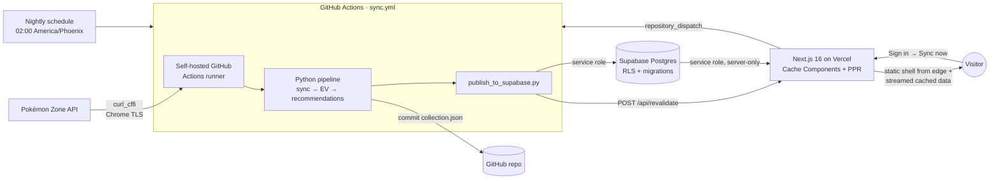

# Pokémon TCG Pocket — Collection Optimizer

A full-stack collection tracker and **pack-opening optimizer** for Pokémon TCG
Pocket. It syncs a live collection from [Pokémon Zone](https://pokemon-zone.com/),
runs an expected-value model over every purchasable pack, and serves the results
as a fast, cached dashboard — telling you exactly which pack to open next for the
most new cards per in-game currency.

**Live:** https://pokemon-tcgp-db-ten.vercel.app

> A personal tool built as a study in modern full-stack engineering: a Python
> analytics pipeline, a Postgres data layer with row-level security, and a
> Next.js 16 front end using Cache Components / Partial Prerendering — wired
> together by a CI-driven sync that runs on a self-hosted runner.

<!-- Screenshots: drop dashboard / cards / history images in docs/ and reference them here. -->

---

## What it does

- **Syncs** your collection from Pokémon Zone (exact card identity, no fuzzy
  matching) — nightly, and on demand from the dashboard.
- **Scores** all 27 purchasable packs with an EV model that weights new cards,
  duplicates, and rarity, adjusted by a per-pack confidence factor.
- **Recommends** what to open next given your hourglass balance.
- **Builds decks** against a rules engine (20 cards, copy limits across
  printings, energy zone, evolution lines) with Trainer suggestions derived from
  card rule text.
- **Adopts new sets** — a released expansion is detected on sync and registered
  in one click, sources verified before anything is written.
- **Tracks drift** — an append-only history of how your collection and pack
  rankings change over time, charted on `/history`.
- **Public read, owner-gated writes** — anyone can browse the collection and
  recommendations; only the authenticated owner can trigger a sync.

---

## Architecture

The Python pipeline stays the **source of truth** for all analytics; hosting is
purely additive behind two seams (`DataSource` for reads, `SyncRunner` for
writes), so the same code runs locally against JSON files or in production
against Postgres.



### Data flow: sync → publish → serve

1. **Trigger** — nightly on a schedule, or the owner clicks *Sync now* on the
   dashboard, which fires a GitHub `repository_dispatch` from a stateless
   `SyncRunner` (it does **not** run Python on Vercel — Python can't run there).
2. **Sync** — the workflow runs on a **self-hosted runner** (GitHub's cloud IPs
   are blocked by Cloudflare; a home-network runner is not). It fetches the
   collection using `curl_cffi` Chrome impersonation with stored auth.
3. **Compute** — the untouched pipeline builds pack EV + recommendations.
4. **Publish** — `publish_to_supabase.py` upserts the artifacts into Postgres
   with the service-role key and appends a recommendation snapshot.
5. **Invalidate** — the workflow POSTs to a secret-guarded `/api/revalidate`,
   which calls `revalidateTag()` so the next request re-reads fresh data.
6. **Serve** — the web app returns a prerendered static shell from the CDN edge
   and streams the cached, per-request data into it.

The web app never blocks the deploy on pipeline artifacts (they're gitignored),
so CI and fresh checkouts build cleanly in a data-free `local-json` mode.

---

## Tech stack

| Layer | Choices |
|---|---|
| **Front end** | Next.js 16 (App Router, **Cache Components / PPR**), React 19, TypeScript, Tailwind CSS v4, Base UI + shadcn-style components, Recharts |
| **Data / auth** | Supabase Postgres, Row-Level Security, `@supabase/ssr` (session cookies via Next 16 `proxy.ts`), Zod-validated contracts |
| **Pipeline** | Python 3, `curl_cffi` (Chrome TLS impersonation), a pure-function EV model |
| **Infra / CI** | Vercel (Fluid Compute), GitHub Actions (self-hosted + cloud runners), tag-based cache invalidation |
| **Testing** | Vitest (web) + a `DataSource` parity contract, pytest with a golden-snapshot regression gate |

---

## Engineering highlights

The parts that were interesting to build:

- **Cache Components + PPR, not `force-dynamic`.** Every page renders a
  prerendered static shell (served from the edge) plus `<Suspense>` dynamic
  holes streaming cached data. Data readers are wrapped in `use cache` +
  `cacheTag`, so ~3,500-row Supabase reads become cache hits invalidated only on
  publish — turning a ~2.4 s cold TTFB into an edge cache hit (`x-vercel-cache: HIT`).
- **Keeping the CI build green under Cache Components.** Because the CI build
  runs data-free, cached reads are forced runtime-only (via `connection()` or
  the request's own `searchParams`/`params`) so they never execute during
  prerender against missing artifacts.
- **Public read / owner-gated writes.** Reads use the service-role key
  server-side (never shipped to the client); the sync **write** path is gated to
  the authenticated owner's UUID — closing a would-be public trigger for the
  whole pipeline.
- **Cloudflare-aware sync.** The sync is pure HTTP with stored auth, but
  Cloudflare blocks datacenter IPs — so the live sync runs on a self-hosted
  runner, with graceful `needs-reauth` handling surfaced in the UI when the
  ~3–4-week PZ session lapses.
- **A sync that cannot quietly lie.** The hard part of depending on someone
  else's API is not failure, it is *apparent* success. A run now proves it
  refreshed by comparing Pokémon Zone's own ingest timestamp against the previous
  run, counts any owned card its catalog could not name instead of dropping it,
  and reports GitHub's real workflow status rather than inferring one from a
  timeout. Each of those replaced a way the pipeline had reported success while
  republishing stale data.
- **Sourced over inferred.** Where the game's rules need data we do not directly
  have — which printings are the same card, which sets exist — the pipeline
  prefers a signal from upstream over a heuristic, and skips rather than guesses
  when the signal is ambiguous. Inferring dex registration by matching names
  across the catalog overstated completion by ~3×; decoding Pokémon Zone's own
  hybrid coordinates matched the game exactly.
- **One data model, two backends.** A `DataSource` interface
  (`web/lib/data/`) has a `local-json` and a `supabase` implementation, both
  validated through the **same Zod schemas** and checked by a parity contract
  test — so hosting never forked the read logic.

---

## Data model

Postgres schema in `supabase/migrations/` (applied in order):

| Migration | Adds |
|---|---|
| `0001_init` | Global catalog tables + per-user tables (collection, EV, recommendations, sync status) with RLS |
| `0002_auth_owner` | Seeds the auth owner, backfills `user_id`, adds the FK, drops temporary anon policies |
| `0003_sync_last_run` | `sync_status.last_run` completion marker for honest sync-completion reporting |
| `0004_recommendation_snapshots` | Append-only history table powering `/history` |
| `0005_power_score_kind` | Which model produced a card's power score — Pokémon and Trainer scores share a range but measure different things, so the kind travels with the number |
| `0006_decks` | Saved decks (cards as JSONB coordinates, energy types) |
| `0007_trainer_boosts` | Which Pokémon a Trainer's rule text restricts it to helping |
| `0008_printing_groups` | Coords that are the same physical card, so one copy can credit every dex slot it registers in |
| `0009_sync_pending_sets` | Expansions Pokémon Zone serves that the pipeline has not registered yet |

Global data (cards, packs, odds) has no `user_id`; per-user data carries
`user_id` with `user_id = auth.uid()` policies — modeled multi-user, run
single-tenant.

---

## EV model

```
EV per pack = Σ (p_pull × value_of_next_copy)

value_of_next_copy (per printing):
  owned = 0  →  1.0 + RARITY_BONUS[rarity]   (ultra_rare 10.0 … uncommon 0.0)
  owned = 1  →  0.4
  owned ≥ 2  →  0.0

unified_score = new_card_ev_10x×1.0 + copy_ev×0.2 + deck_target_ev×1.5
               (× confidence_weight; 1.0 for pz_verified packs)
```

Pull odds come from Pokémon Zone pack pages, cross-checked against Bulbapedia;
packs that aren't fully verified take a confidence haircut.

**Ownership is credited across printings.** Since the 2026-07-29 game update a
card obtained from any pack registers in the dex under *every* expansion it
appears in, so printings are no longer independent: pulling the Deluxe Pack: ex
printing of a card you already hold is a duplicate, not a new card. Groups are
sourced from Pokémon Zone's own data — never inferred by matching names across
the catalog, which overstated completion by roughly 3× when it was tried.

**A ◆◆◆◆-or-higher guarantee** exists in game (after 12 consecutive openings from
one expansion without one) and is modelled but inert: 12 misses is longer than
the 10-pack batch the model scores, so it can never be forced inside one. It is
recorded as a verified zero rather than dropped, so a future batch size or
threshold change makes it bite immediately.

---

## Local development

### Web app

```bash
cd web
npm install
npm run dev          # DATA_SOURCE defaults to local-json (reads pipeline artifacts)
npm run build        # production build (Cache Components)
npm test             # Vitest + DataSource parity contract
npm run test:e2e     # Playwright, desktop + mobile
npm run build:ci     # data-free build — what CI actually runs
```

To run against Supabase locally, set `DATA_SOURCE=supabase` plus the Supabase
env vars (see `web/lib/env.ts` — all server-only, none `NEXT_PUBLIC_`).

### Python pipeline

```bash
python3 scripts/run_recommendations.py            # full run: sync + EV + recommendations
python3 scripts/run_recommendations.py --skip-sync # recompute from current collection.json
python3 -m pytest tests/ -q                        # full suite incl. golden snapshot
```

**Common flags:** `--skip-sync`, `--json-import [FILE]`, `--dry-run-sync`,
`--promo`, `--full-rankings`, `--include-limited`, `--series {A,B}`.
**Exit codes:** `0` OK · `1` fatal · `2` review-queue items · `3` PZ auth expired
(collection not refreshed; consumed by the web sync runner as *needs re-auth*).

Sync options (bookmarklet / stored-auth headless / HAR import) and reference-data
rebuild scripts are documented inline in `scripts/` and
[`docs/`](docs/). `collection.json` is the tracked source of truth; `data/current/`,
`data/exports/`, and `review/` are gitignored build artifacts.

---

## Testing & CI

`.github/workflows/ci.yml` runs on every PR and push to main:

- **`test`** — 415 pytest tests including a **golden-snapshot** gate that fails
  if EV/recommendation output drifts (the pipeline is never edited for hosting),
  plus the reference-data validators.
- **`web`** — `lint`, `typecheck`, Vitest, and `next build` in data-free mode
  (the same constraint production caching had to satisfy).
- **`e2e`** — Playwright against a real build, on desktop and mobile viewports.

Much of the suite is regression-shaped: tests named for the bug they prevent,
several of which assert a *structural* property (that the card matcher is the
normalizer built for it, that printing groups are not inferred, that every
published column has a migration) so the mistake cannot quietly return.

`sync.yml` handles live syncs — nightly at 02:00 America/Phoenix, on
`repository_dispatch` from the dashboard, or manually — plus `--skip-sync`
republishes on push to main. `adopt-set.yml` registers a newly released
expansion, verifying every source URL before writing and reverting if the guard
tests fail.

---

## Project structure

```
scripts/                Python pipeline (sync, EV model, publisher) — 35 scripts
tests/                  pytest suite (42 files) + golden snapshot
supabase/migrations/    Postgres schema (0001–0009)
docs/adding-a-set.md    New-set runbook + retrospective on each release
web/
  app/                  App Router: dashboard, cards, sets, packs, decks,
                        history + /api/revalidate + proxy.ts
  components/           UI (dashboard, cards, packs, sets, decks, sync, layout)
  e2e/                  Playwright specs (desktop + mobile)
  lib/data/             DataSource seam: local-json | supabase | cached wrappers
  lib/domain/           Pure model code (EV shaping, deck rules, rarity, groups)
  lib/auth/             @supabase/ssr server client + owner checks
  types/                Zod schemas — the single validated contract
.github/workflows/      ci.yml, sync.yml, adopt-set.yml
```

---

## Roadmap / limitations

- **Single upstream.** Everything depends on Pokémon Zone having ingested the
  collection, and there is no alternative: the game publishes no collection API,
  and the only machine-readable path is authenticating to its servers as the
  player — which is what PZ does with stored credentials, and not something worth
  reimplementing. A multi-day PZ outage in August 2026 is the worst case seen so
  far. The mitigation is detection, not redundancy: syncs prove the upstream
  actually refreshed and say how old its data is when it did not.
- **Deck-building EV (deferred):** the deck builder exists, but the EV model
  still optimizes for collection completion; `deck_target_ev` is wired and inert
  until a producer for deck targets lands.
- **Wonder Pick / trade / craft:** not modelled.
- **Display-side printing groups:** ownership crediting is sourced per card from
  Pokémon Zone, so the "collapse reprints to their debut printing" display rule
  only applies to cards it has reported on — unowned reprints do not collapse.
- **Multi-user:** data is modeled for it (per-user rows + RLS), but the app runs
  single-tenant — flipping it on is "enable signup + per-user sync," not a migration.
